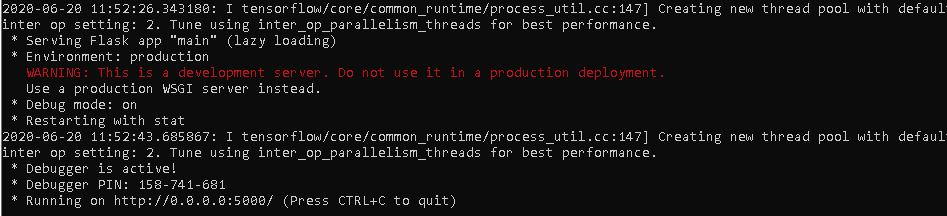

# Emotion_detection

This projects aim to classify real time facial emotion recoginition to either of one of the universal seven emotions using Deep 
convolutional neural network(CNN) learning and open cv 

## Installation using command line using pip
1. pip install opencv-python
2. pip install tensorflow
3. pip install keras

## Installation using Anaconda prompt
1. conda install opencv-python
2. conda install tensorflow
3. conda install keras

## Note:
If you are using GPU then uncomment this code block in **model.py**

'''config = tf.compat.v1.ConfigProto()

config.gpu_options.per_process_gpu_memory_fraction = 0.15

session = tf.compat.v1.Session(config=config)'''

## To run the project :
1. First extract train folder and test folder from this [link](https://drive.google.com/file/d/1eS8KOdo97OHTT3BLZG-wl7UT-J2uBp2w/view?usp=sharing) and get this to the main project folder.

2. open command line or anaconda prompt from this main project folder and type **python main.py**

 
 
3. open your Google chrome and go to localhost:5000 and run your project

# Project Architecture
1. 4 CNN layer with 64,128,256 512 filter respectively 
2. 3 dense layer with 256, 512 and 7 nodes respectively
3. model is converted to json and implemented in flask framework 

 

